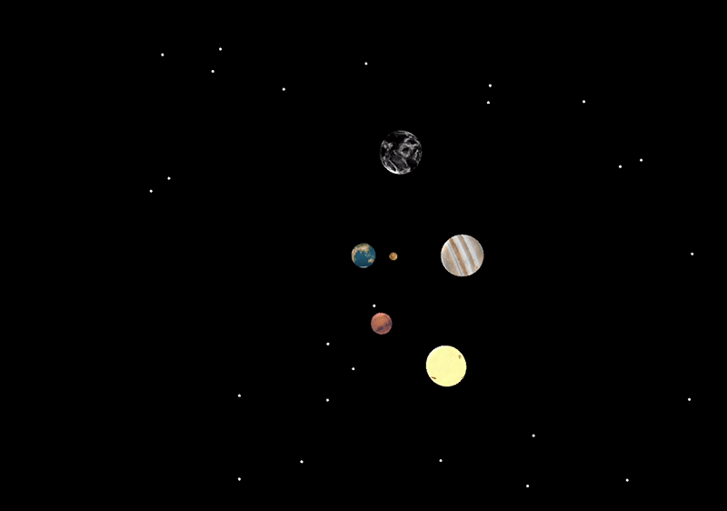

#SolarSytem Simulator

Sketch of the Solar system with Earth at the centre. 

 Under the geocentric model, the Sun, Moon, stars, and planets all orbited Earth 

 Using Processing a language for learning how to code within the context of the visual arts 

